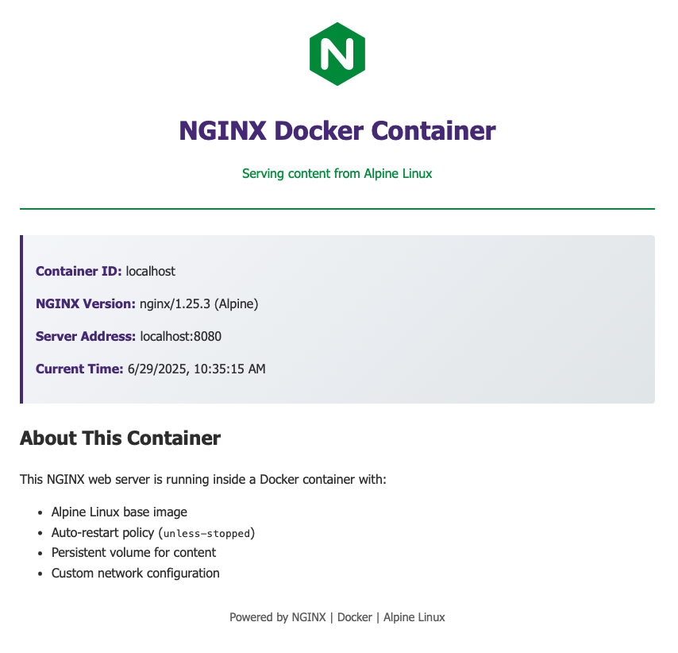
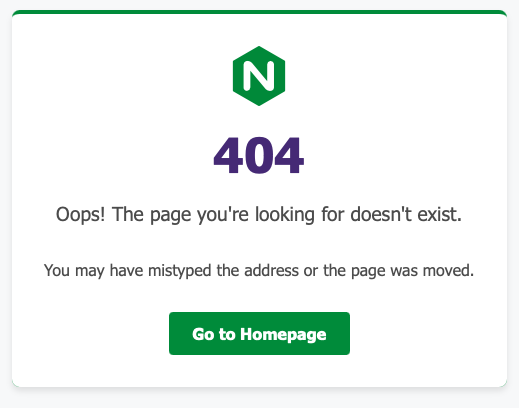
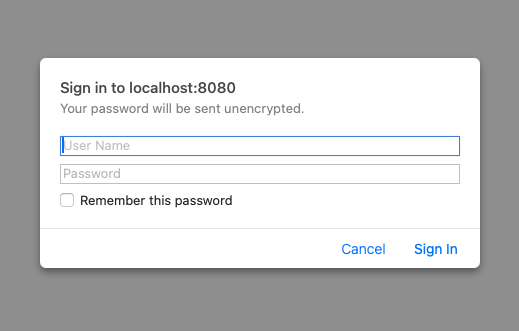

# nginx-volmap
Nginx Alpine 3.22 with host-2-container volume mapping, custom network-index-404 and basic auth

###### Basic Auth
###### The username is: nginx
###### The password is: nginx123
###### You can change password and/or remove the simple auth
# NGINX WEB SERVER - Docker Container

## Fast Setup:
#### Download project zip file
#### Extract zip file
#### At root project folder directory with docker-compose.yml
#### Run command:
#### docker compose up -d
#### Go to http://localhost:8080 to see if successful.

###### Supports hot-reload from host html folder to nginx web serve folder

